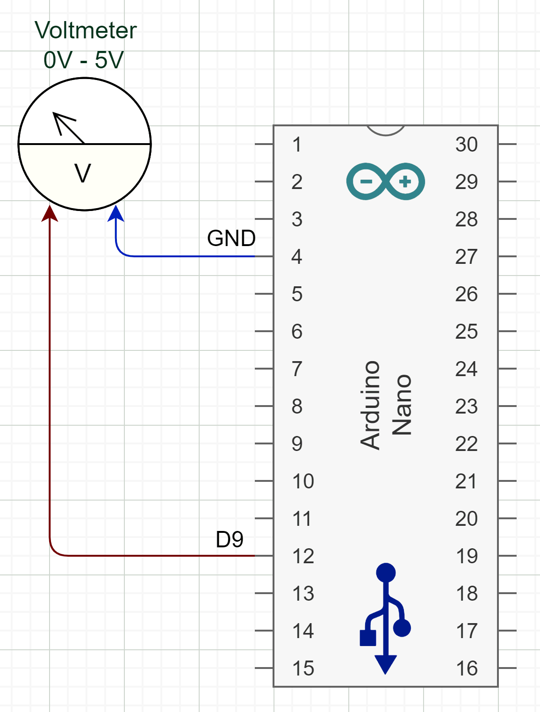

# Arduino-CPU-Meter
Host and device code for external hardware CPU meter based on Arduino.

Linux GCC Makefile and Windows MSVC project files are provided.
Specify your serial port when launching program:

<ul>
    <li> Windows default: <b>COM7</b> </li>
    <li> Linux default: <b>/dev/ttyS7</b> </li>
</ul>

Connect a 5V voltmeter to Arduino between **Pin9** and **GND**.
See [Arduino.ino](Arduino.cpp) file for Arduino code.

**[ Circuit diagram ]**

A precompiled executable is also provided (see "Releases") however in Windows you will probably need to install the <a href="https://www.wch-ic.com/downloads/CH341SER_ZIP.html">CH340 serial chip driver</a> the first time you connect an Arduino to your computer.
You can open the device manager to check if your Arduino is properly detected as a serial port device and also check its COM port number to use as command line argument to launch the program.
